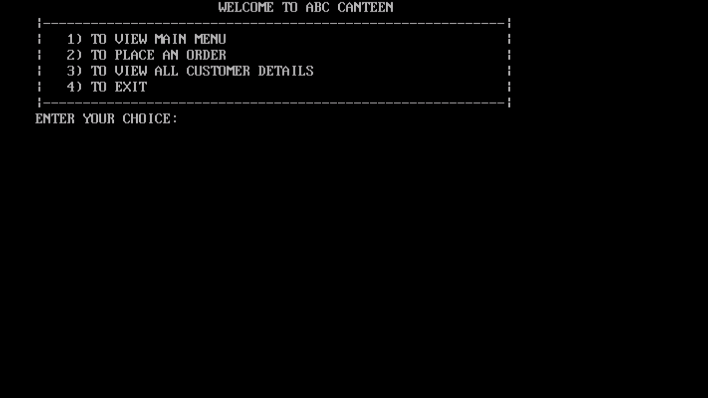
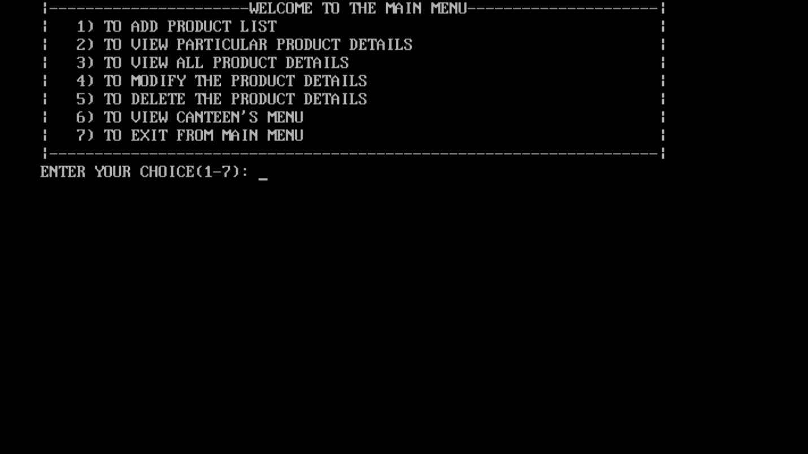
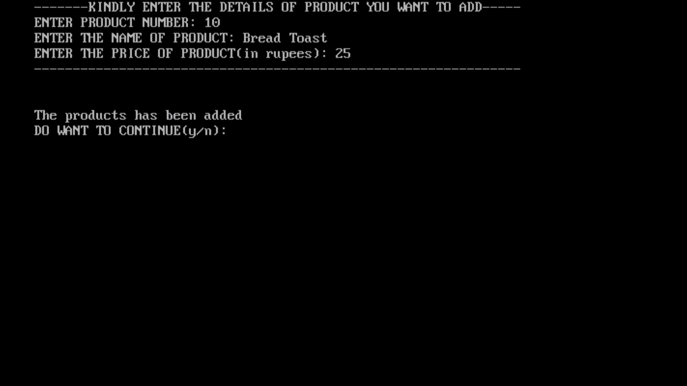
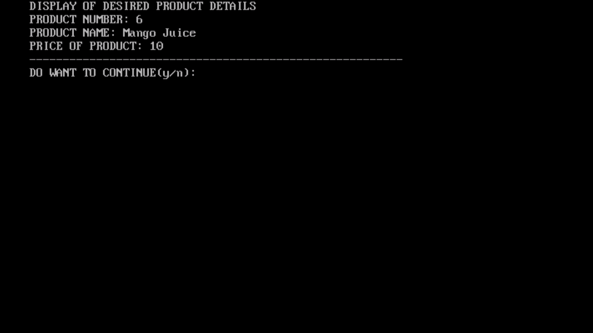
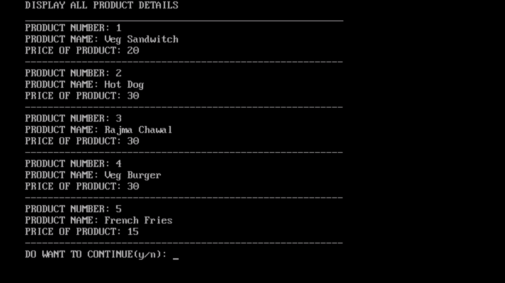
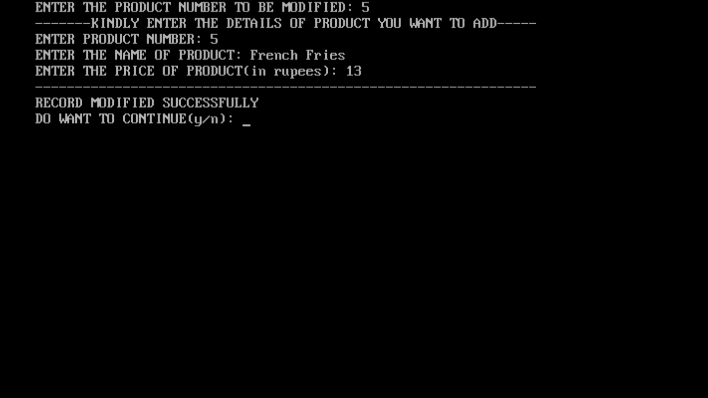
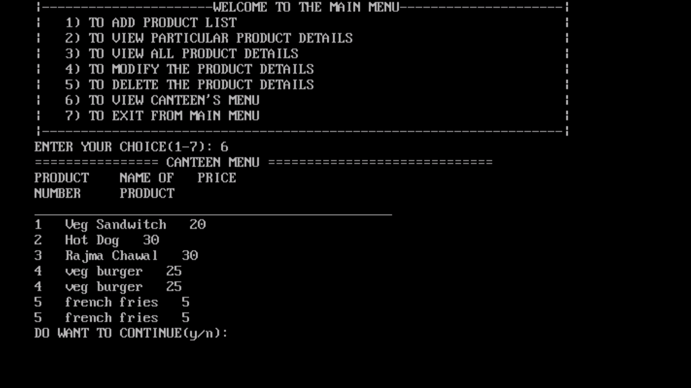
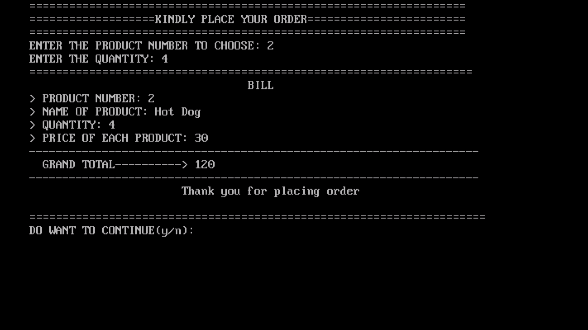

# Canteen-Management

This is a Simple Command Line User Interface program that is implemented using C++ . 
This program is implemented using the concept of Binary Files.

## Walk through video

https://user-images.githubusercontent.com/76027425/168797592-0619d667-aad0-4dd8-b7f6-f840d771bc70.mp4

## Technology Used:
### Language:
- 
### IDE's:
- **Turbo C++**

## Screen-Shots(Output):
The welcome page

Main-Menu Page

To add new product

To display particular product detail

To display all product details

To update a particular product details

To display Full Food Menu

To display Final amount to be paid

