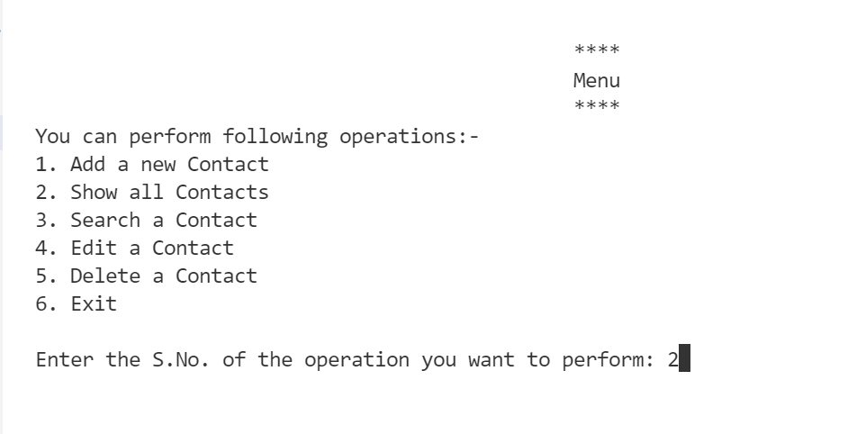

# Contact-Management-System
This Contact Management System has following operations to perform : 
1. Add a new contact detail.
2. Show all existing contact details.
3. Search for a contact detail.
4. Edit existing contact detail.
5. Delete existing contact detail.
<hr>

### Screenshot of menu : 


### TECH USED:
C++, simple function, classes and oops concept, file handling.

### STEPS TO USE : 
**1.** Start by making a fork the [**Dev-Scripts**](https://github.com/abhijeet007rocks8/Dev-Scripts) repository. Click on the <a href="https://github.com/abhijeet007rocks8/Dev-Scripts/fork"></a> symbol at the top right corner

**2.** Clone your new fork of the repository:
#### open git CMD
```bash
git clone https://github.com/<your-github-username>/Dev-Scripts
```

**3.** Navigate to the project directory:
 Dev-Scripts/C++/Contact-Management-System/contactManagementSystem.cpp
 And run in any C++ compiler
 
 Simply click Compile and Run

### Video Demo :


https://user-images.githubusercontent.com/88632352/162033800-b3a41242-5a27-4972-826f-5052c2a8c7f0.mp4

