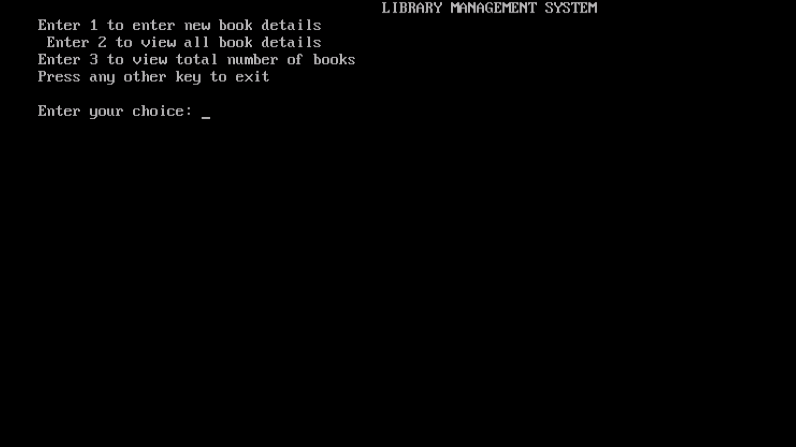
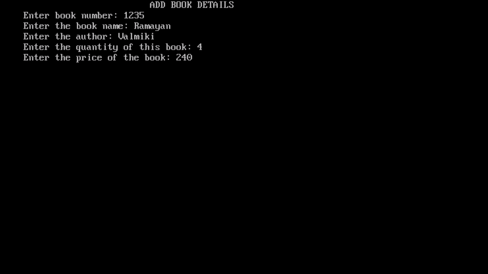
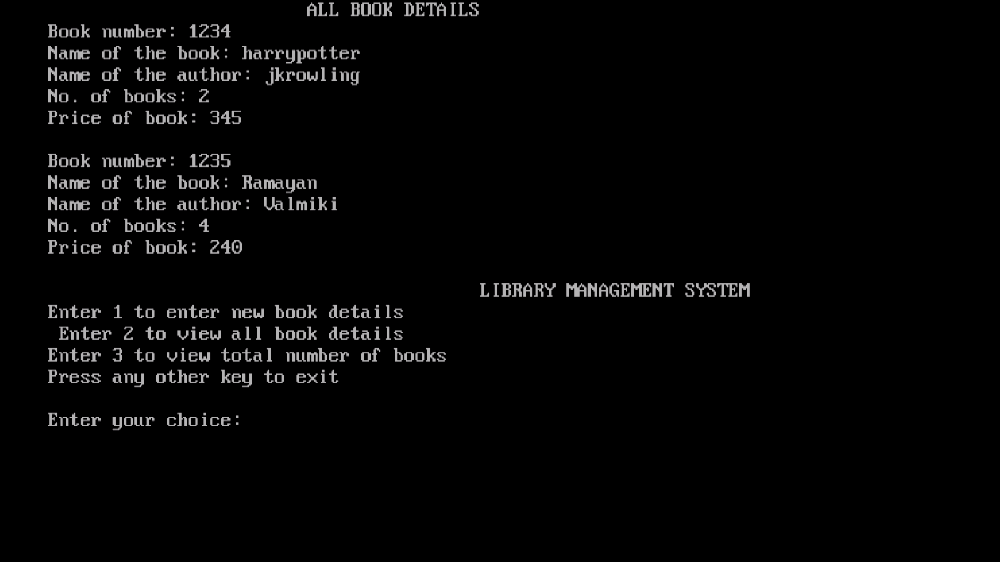
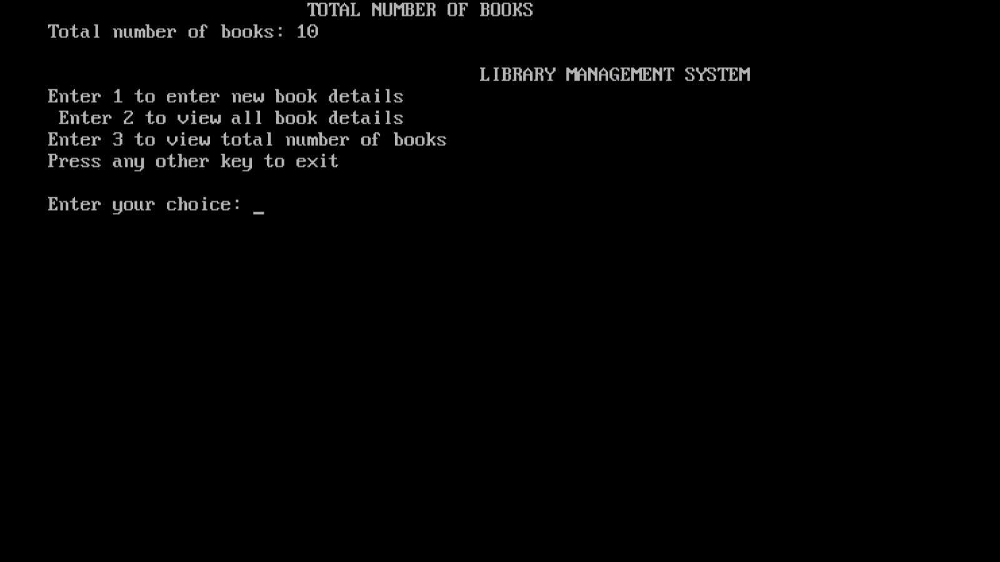

# Library-Management

This is Command Line User Interface to design a Simple Online E-Library Management System.

It is implemented using C programming Language.

## Technology Used: 
### IDE's:
- **Turbo C++**
- **VS Code**

### Language:
- 

### Install Dependencies
```
    /usr/local/include
    libdir/gcc/target/version/include
    /usr/target/include
    /usr/include

    cpp -v

    #include "..." search starts here:
    #include <...> search starts here:
    /usr/local/include
    /usr/lib/gcc/x86_64-linux-gnu/4.4.5/include
    /usr/lib/gcc/x86_64-linux-gnu/4.4.5/include-fixed
    /usr/include/x86_64-linux-gnu
    /usr/include
```

### Quick Start
- Clone this directory
```git clone https://github.com/Kumar-laxmi/Library-Management.git```

- Change Directory
```cd Library-Management```
```gcc LibraryManagementSystem.c```
```./a.out```

### Demo/Walk-through Video:

https://user-images.githubusercontent.com/76027425/170801409-5ca8e328-cd1d-4a0e-97b2-43e420f5229c.mp4


### Output screen-shots:
Main-menu:


Add book detail:


Print all book detail:


To print total number of books:

