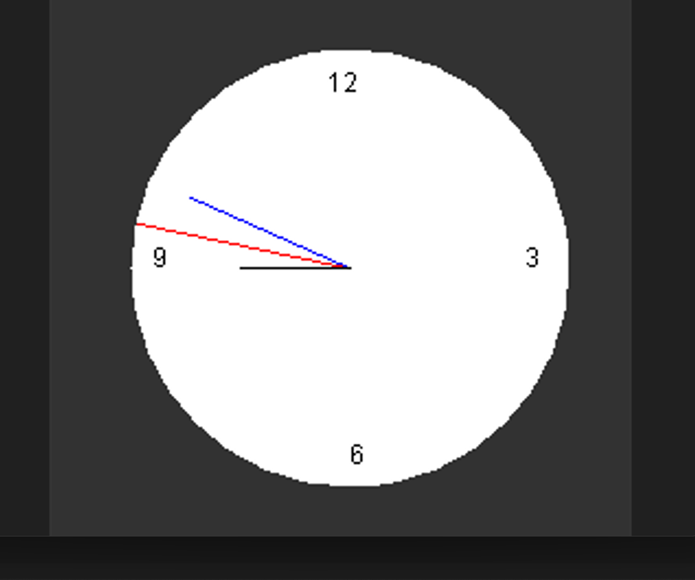
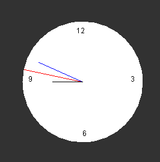
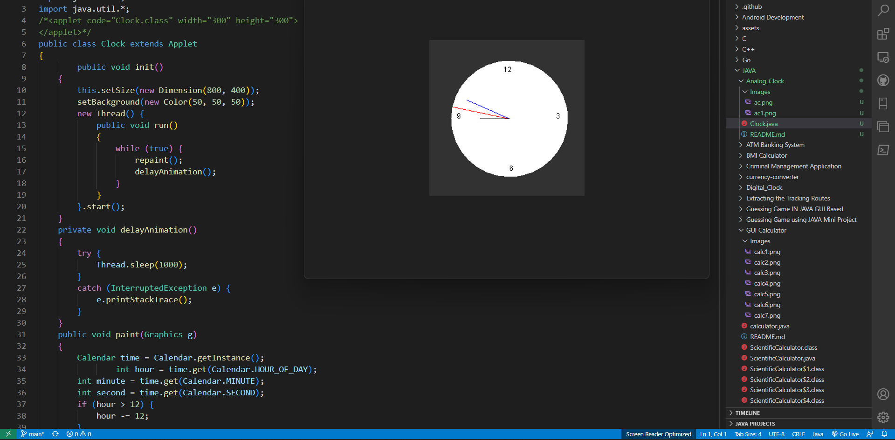
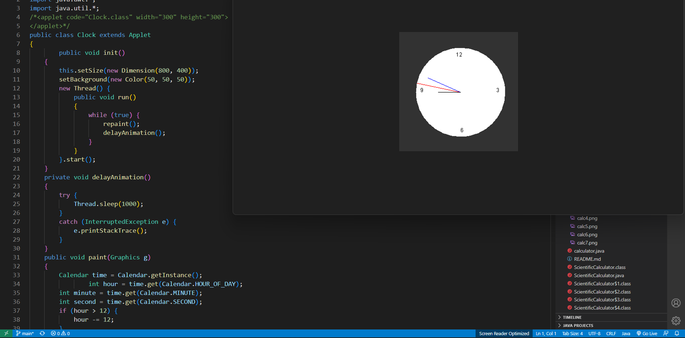
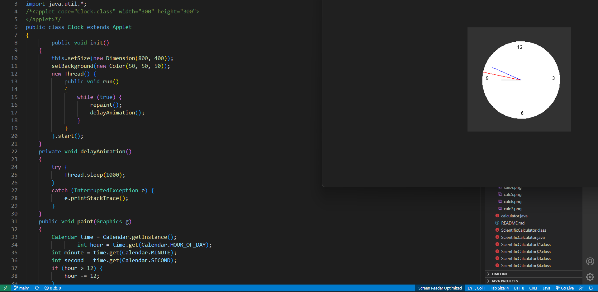

## GUI Calculator

<p align="center">

</p>

It is the Analog Clock written in Java with the help of awt components , Applets. To create GUI based applications, Java provides Applet framework which is a graphical user interface framework that includes a set of classes that are flexible.

To create a Analog clock, we will use Calendar and math classes . The Applet class is used to construct a top-level window for a Java application. The Calendar class is used to get the present time.

## **Quick Start**
- Clone this repository

``` 
git clone https://github.com/abhijeet007rocks8/Dev-Scripts.git
```
- Change Directory

```
cd JAVA
```
```
cd Analog_Clock
```
```
javac Clock.java
```
```
appletviewer Clock.java
```

## **Installation and Dependencies**
- Install JDK kit for java devlopment which supports Applets.
- Install any latest version IDE for java like: Net-Beans, Eclipse, BlueJ, etc.
- Then follow the Quick start steps inside any IDE and then compile and run the project.

## Packages used

### awt package
AWT stands for Abstract Window Toolkit. In Java, AWT is a package used to develop GUI or window-based applications in java.
But `java.awt` components are platform-dependent i.e. components are displayed according to the view of operating system. AWT components are heavyweight i.e. its components depends on the resources of OS (Operating System).

`java.awt` package provides classes such as TextField, Label, TextArea, RadioButton, CheckBox, Choice, List etc.

### Usage

```java
import java.applet.*;  
import java.awt.*;  
import java.util.*;  
import java.text.*;  
```

## Working 

<p align="center">

</p>

The Analog clock to display the current time.


## Screenshots

<p align="center">
  

  <br>
  <br>

  <br>
  <br>

  <br>
  <br>

</p>


## Demonstration
https://media.geeksforgeeks.org/wp-content/uploads/20190514184622/analogClock1.mp4

**Author : Jayanth MKV**

**This Project is contributed to Dev-Script under GSSOC-2022 by Jayanth MKV**