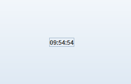

## GUI Calculator

<p align="center">

</p>

It is the Graphical User Interface (GUI) Calculator written in Java with the help of swing and awt components. To create GUI based applications, Java provides Swing framework which is a graphical user interface framework that includes a set of classes that are powerful and flexible.

To create a digital clock, we will use JFrame,JButton and Calendar class from the Swing framework. The JFrame class is used to construct a top-level window for a Java application. The JButton class is used to display a string and the Calendar class is used to get the present time.

## **Quick Start**
- Clone this repository

``` 
git clone https://github.com/abhijeet007rocks8/Dev-Scripts.git
```
- Change Directory

```
cd JAVA
```
```
cd Digital_Clock
```
```
javac Dclock.java
```
```
java Dclocks
```

## **Installation and Dependencies**
- Install JDK kit for java devlopment.
- Install any latest version IDE for java like: Net-Beans, Eclipse, BlueJ, etc.
- Then follow the Quick start steps inside any IDE and then compile and run the project.

## Packages used

### swing package
Java Swing is a part of Java Foundation Classes (JFC) that is used to create window-based applications. It is built on the top of AWT (Abstract Windowing Toolkit) package and entirely written in java. `javax.swing` components are platform-independent or lightweight components i.e. its components doesn't depends on the resources of the OS (Operating System).

`javax.swing` package provides classes such as JButton, JTextField, JTextArea, JRadioButton, JCheckbox, JMenu, JColorChooser etc.

### awt package
AWT stands for Abstract Window Toolkit. In Java, AWT is a package used to develop GUI or window-based applications in java.
But `java.awt` components are platform-dependent i.e. components are displayed according to the view of operating system. AWT components are heavyweight i.e. its components depends on the resources of OS (Operating System).

`java.awt` package provides classes such as TextField, Label, TextArea, RadioButton, CheckBox, Choice, List etc.

### Usage

```java
import javax.swing.*;
import java.awt.*;
import java.util.*;
import java.text.*;
```

## Working 

<p align="center">

</p>

The Digital clock has much simpler design because we have to use the graphical components like button to display the current time.


## Screenshots

<p align="center">
  

  <br>
  <br>

  <br>
  <br>

  <br>
  <br>

</p>


**Author : Jayanth MKV**

**This Project is contributed to Dev-Script under GSSOC-2022 by Jayanth MKV**