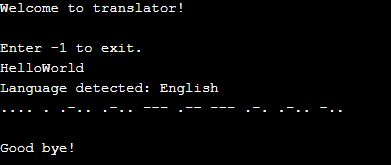

# MorseCode Generator
***
## Introduction
This is a code written in JAVA Programming Language to convert any piece of Text into MorseCode.

***
## Features
* Converts Text to MorseCode.
* Protects Sensitive Text.

## **Quick Start**
- Clone this repository

``` 
git clone https://github.com/abhijeet007rocks8/Dev-Scripts.git
```
- Change Directory

```
cd JAVA
```
```
cd Morse Code Generator
```
```
cd MorseCode_Generator.java
```
***
## How to Use
1. Pull the code into your system.
2. Run **MorseCode_Generator.java**.
3. Enter the text you want to convert to MorseCode or enter -1 to exit.
4. Converted Morse Code will be displayed.

***
## Output


**Author : Heet kumar Kothadiya**

**This Project is contributed to Dev-Script under Hacktoberfest'21, 2021 by Heet kumar Kothadiya**