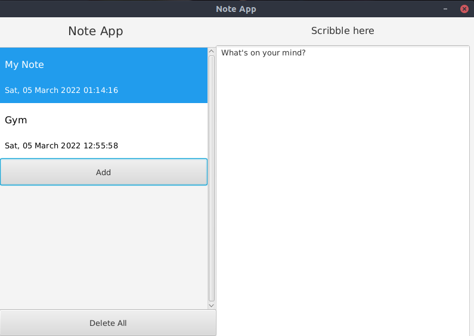
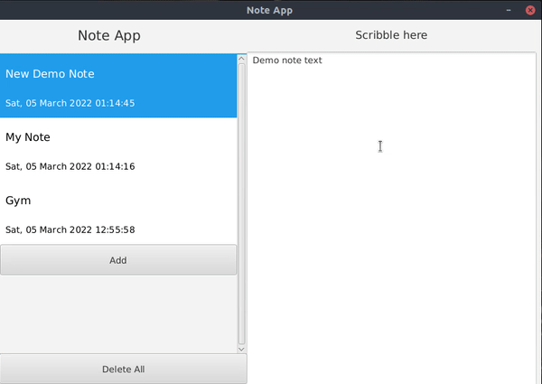
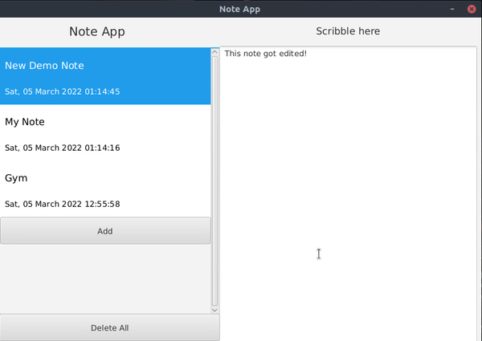
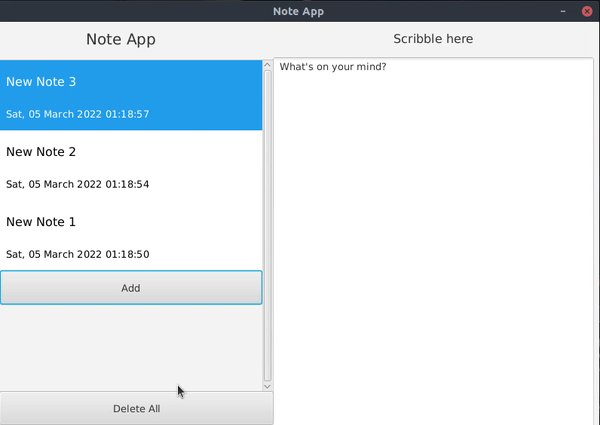

# Note App

<p align="center">

</p>

This is a simple note keeping application built using java.

## **Quick Start**
- Clone this repository

``` 
git clone https://github.com/abhijeet007rocks8/Dev-Scripts.git
```

- Change Directory

```
cd Dev-Scripts/JAVA/note-app
```
## **Installation and Dependencies**
This project uses maven for its dependency management. Hence, there is no need for installing the dependencies manually.

#### Installing maven -
- Download and install from https://maven.apache.org/download.cgi (Windows)
- `sudo apt install maven` (Debian linux)
- `sudo yum install maven` (Fedora linux)
- Make sure maven is included in the `PATH` environmental variable

#### Running the application
- `mvn clean javafx:run`

#### Deploying the application
- `mvn package`
- Check the output log to see where the application was deployed
- Install JavaFX on your computer locally
- Run the produced jar file in the target folder to execute the application
- Ensure that `java-17` is installed
- Command - `java --module-path /path/to/javafx/lib --add-modules javafx.controls,javafx.base,javafx.fxml -jar outputfile.jar`

## Demo

- Creating a note
<p align="center">

</p>

- Editing a note
<p align="center">

</p>

- Deleting a note
<p align="center">

</p>

- Deleting all notes
<p align="center">

</p>

## Packages used
### JavaFX
JavaFX from `org.openjfx` is used to provide the  

# Tech Stack
- Java
- JavaFX
- JSON

**Author : Rajdip Bhattacharya**