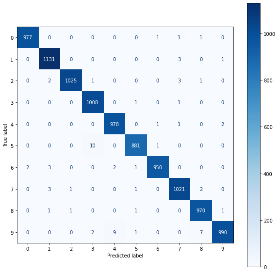

### MNIST DIGIT CLASSIFICATION

This is a simple `REST` api that is served to classify `mnist` hand written digits given a hand written image of a digit. The digits that will be classifies ranges from `0` to `9`.

<p align="center" with="100%">
</p>

### Starting the server

To run this server and make prediction on your own images follow the following steps

1. create a virtual environment and activate it
2. run the following command to install packages

```shell
pip install -r requirements.txt
```

3. navigate to the `app.py` file and run

```shell
python app.py
```

### Model

We are using a simple the modified version of `LeNet` to classify our handwritten digits. Our `LeNet` modified version looks as follows:

```py
class LeNet(nn.Module):
    def __init__(self, output_dim):
        super(LeNet, self).__init__()
        self.features = nn.Sequential(
            nn.Conv2d(in_channels=1, out_channels=6, kernel_size =5),
            nn.MaxPool2d(kernel_size=2),
            nn.ReLU(),
            nn.Conv2d(in_channels=6, out_channels=16, kernel_size =5),
            nn.MaxPool2d(kernel_size=2),
            nn.ReLU()
        )
        self.classifier = nn.Sequential(
            nn.Linear(16 * 4 * 4, 120),
            nn.ReLU(),
            nn.Linear(120, 84),
            nn.ReLU(),
            nn.Linear(84, output_dim)
        )

    def forward(self, x):
        x = self.features(x) # x = [batch size, 16, 4, 4]
        x = x.view(x.shape[0], -1) # x = [batch size, 16*4*4 = 256]
        x = self.classifier(x) # x = [batch size, output dim]
        return x
```

> All images are transformed to `grayscale`.

### Model Metrics

The following table shows all the metrics summary we get after training the model for few `10` epochs.

<table border="1">
    <thead>
      <tr>
        <th>model name</th>
        <th>model description</th>
        <th>test accuracy</th>
        <th>validation accuracy</th>
        <th>train accuracy</th>
         <th>test loss</th>
        <th>validation loss</th>
        <th>train loss</th>
      </tr>
    </thead>
    <tbody>
      <tr>
        <td>mnist-classifier.pt</td>
        <td>hand written digit classification using modified LeNet</td>
        <td>99.31% </td>
        <td>98.95%</td>
        <td>99.08%</td>
        <td>0.021</td>
        <td>0.033</td>
        <td>0.030</td>
      </tr>
       </tbody>
  </table>

### Confusion matrix

The following image represents a confusion matrix for the first batch in the validation set which contains `64` images in a batch:

<p align="center" with="100%">
</p>

### Hand Written Digit classification

If you hit the server at `http://localhost:3001/api/mnist` you will be able to get the following expected response that is if the request method is `POST` and you provide the file expected by the server.

### Expected Response

The expected response at `http://localhost:3001/api/mnist` with a file `image` of the right format will yield the following `json` response to the client.

```json
{
  "predictions": {
    "all": [
      { "class_name": "zero", "label": 0, "probability": 5.570538519350521e-8 },
      { "class_name": "one", "label": 1, "probability": 1.3423530731415667e-7 },
      { "class_name": "two", "label": 2, "probability": 5.059959676145809e-6 },
      {
        "class_name": "three",
        "label": 3,
        "probability": 1.7506766880615032e-7
      },
      {
        "class_name": "four",
        "label": 4,
        "probability": 1.0873828614421654e-5
      },
      { "class_name": "five", "label": 5, "probability": 5.96822474108194e-7 },
      { "class_name": "six", "label": 6, "probability": 7.623108394527733e-11 },
      { "class_name": "seven", "label": 7, "probability": 0.9998482465744019 },
      {
        "class_name": "eight",
        "label": 8,
        "probability": 3.803578749739245e-7
      },
      { "class_name": "nine", "label": 9, "probability": 0.0001344333286397159 }
    ],
    "prediction": {
      "class_name": "seven",
      "label": 7,
      "probability": 0.9998482465744019
    }
  },
  "success": true
}
```

### Using `curl`

Make sure that you have the image named `7.png` in the current folder that you are running your `cmd` otherwise you have to provide an absolute or relative path to the image.

> To make a `curl` `POST` request at `http://localhost:3001/api/mnist` with the file `7.png` we run the following command.

```shell
curl -X POST -F image=@7.png http://127.0.0.1:3001/api/mnist
```

### Using Postman client

To make this request with postman we do it as follows:

1. Change the request method to `POST`
2. Click on `form-data`
3. Select type to be `file` on the `KEY` attribute
4. For the `KEY` type `image` and select the image you want to predict under `value`
5. Click send

If everything went well you will get the following response depending on the face you have selected:

```json
{
  "predictions": {
    "all": [
      { "class_name": "zero", "label": 0, "probability": 5.570538519350521e-8 },
      { "class_name": "one", "label": 1, "probability": 1.3423530731415667e-7 },
      { "class_name": "two", "label": 2, "probability": 5.059959676145809e-6 },
      {
        "class_name": "three",
        "label": 3,
        "probability": 1.7506766880615032e-7
      },
      {
        "class_name": "four",
        "label": 4,
        "probability": 1.0873828614421654e-5
      },
      { "class_name": "five", "label": 5, "probability": 5.96822474108194e-7 },
      { "class_name": "six", "label": 6, "probability": 7.623108394527733e-11 },
      { "class_name": "seven", "label": 7, "probability": 0.9998482465744019 },
      {
        "class_name": "eight",
        "label": 8,
        "probability": 3.803578749739245e-7
      },
      { "class_name": "nine", "label": 9, "probability": 0.0001344333286397159 }
    ],
    "prediction": {
      "class_name": "seven",
      "label": 7,
      "probability": 0.9998482465744019
    }
  },
  "success": true
}
```

### Using JavaScript `fetch` api.

1. First you need to get the input from `html`
2. Create a `formData` object
3. make a POST requests

```js
const input = document.getElementById("input").files[0];
let formData = new FormData();
formData.append("image", input);
fetch("http://127.0.0.1:3001/api/mnist", {
  method: "POST",
  body: formData,
})
  .then((res) => res.json())
  .then((data) => console.log(data));
```

If everything went well you will be able to get expected response.

```json
{
  "predictions": {
    "all": [
      { "class_name": "zero", "label": 0, "probability": 5.570538519350521e-8 },
      { "class_name": "one", "label": 1, "probability": 1.3423530731415667e-7 },
      { "class_name": "two", "label": 2, "probability": 5.059959676145809e-6 },
      {
        "class_name": "three",
        "label": 3,
        "probability": 1.7506766880615032e-7
      },
      {
        "class_name": "four",
        "label": 4,
        "probability": 1.0873828614421654e-5
      },
      { "class_name": "five", "label": 5, "probability": 5.96822474108194e-7 },
      { "class_name": "six", "label": 6, "probability": 7.623108394527733e-11 },
      { "class_name": "seven", "label": 7, "probability": 0.9998482465744019 },
      {
        "class_name": "eight",
        "label": 8,
        "probability": 3.803578749739245e-7
      },
      { "class_name": "nine", "label": 9, "probability": 0.0001344333286397159 }
    ],
    "prediction": {
      "class_name": "seven",
      "label": 7,
      "probability": 0.9998482465744019
    }
  },
  "success": true
}
```

### Deployed version of the server

The server is deployed at https://lenet-mnist.herokuapp.com/. You can start making prediction using `https://lenet-mnist.herokuapp.com/` as a base url.

### Notebooks

The notebook used for training this model can be found in the `notebooks` folder in this repository.
