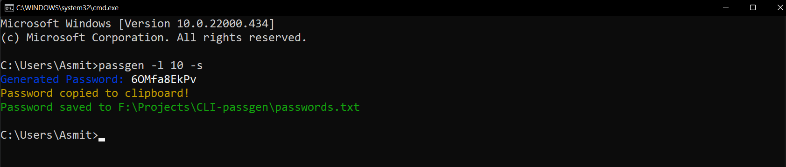

# CLI Password Generator

## Description 
Command line app to generate random passwords. This uses crypto module due to which generated passwords are totally random, and unpredictable.

## Tech Stack

NodeJS 

## Demonstration



## Usage

* Install NodeJS and npm from [official website](https://nodejs.org/en/). The setup includes both node and npm packages.

* Clone this repository

```
git clone https://github.com/abhijeet007rocks8/Dev-Scripts.git
```

* Change Directory

```
cd NodeJS
```
```
cd CLI Password Generator
```

* Install dependencies

```
npm install
```

* Run file

```
node index (options)
```

* To create a symlink to run "passgen" from anywhere

```
npm link

# Now you can run
passgen (options)

# To remove symlink
npm unlink 
or
npm uninstall -g passgen (to completely remove the package)
```

## Options

| Short | Long              | Description                     |
| ----- | ----------------- | ------------------------------- |
| -l    | --length <number> | length of password (default: 8) |
| -s    | --save  [string]  | default: save password to passwords.txt  |
| -nn   | --no-numbers      | remove numbers                  |
| -ns   | --no-symbols      | remove symbols                  |
| -h    | --help            | display help for command        |
| -V    | --version         | Show the version                |
