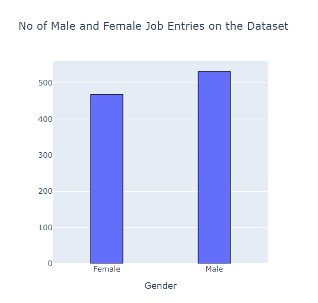
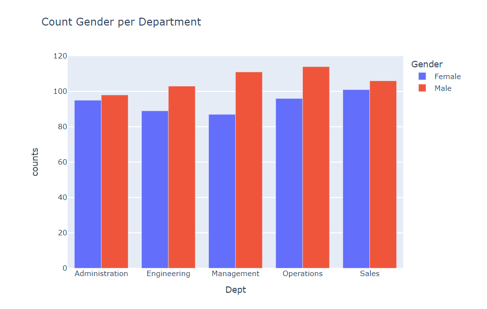
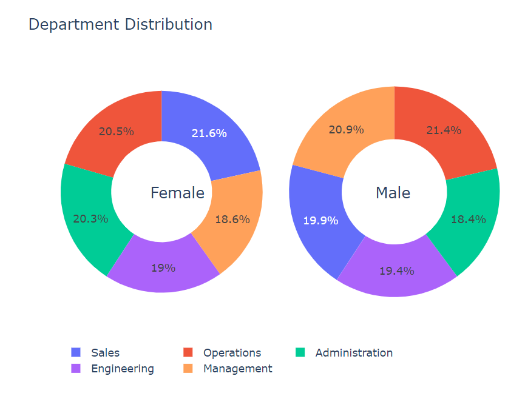
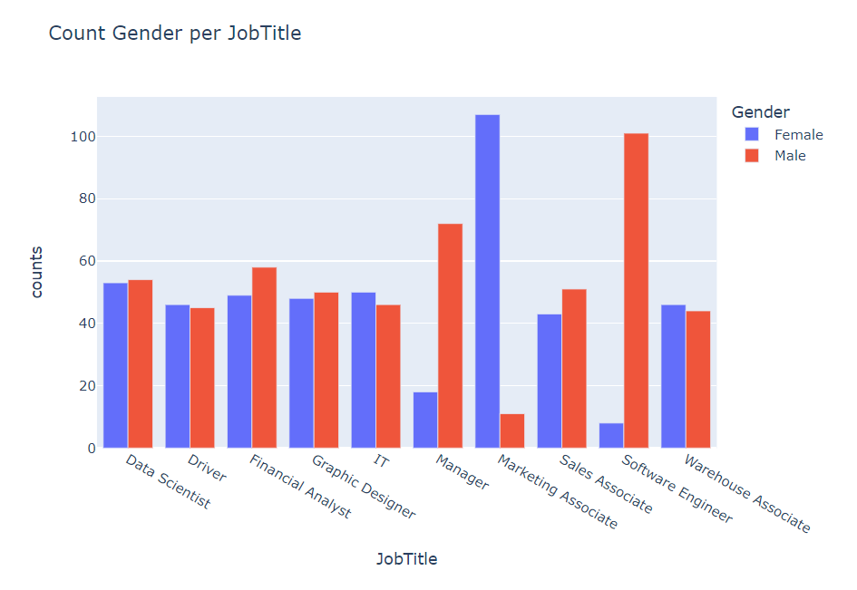
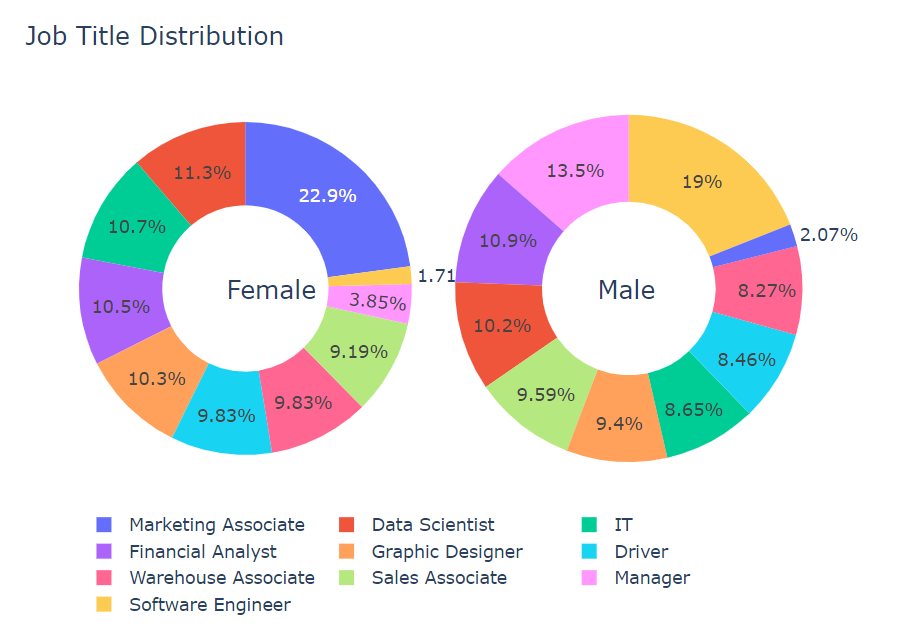

# **Gender Pay Gap Analysis**

**AIM**

The aim of the project was to analyse the pay gap between males and females using glassdoor dataset.

**DATASET**

Dataset can be downloaded from [here](https://www.kaggle.com/nilimajauhari/glassdoor-analyze-gender-pay-gap).

**STEPS**
- Importing Libraries
- Data Visualisation

**Data Visualisation**
  

**LIBRARIES USED**
- pandas
- numpy
- plotly
- seaborn
- matplotlib
- os
