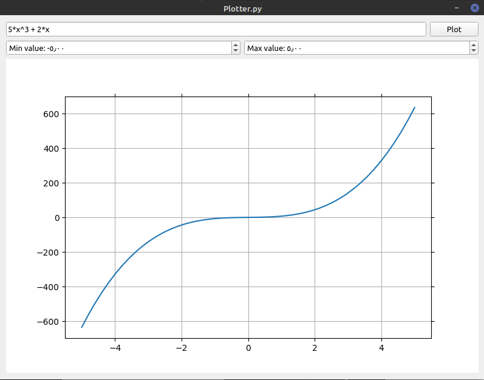
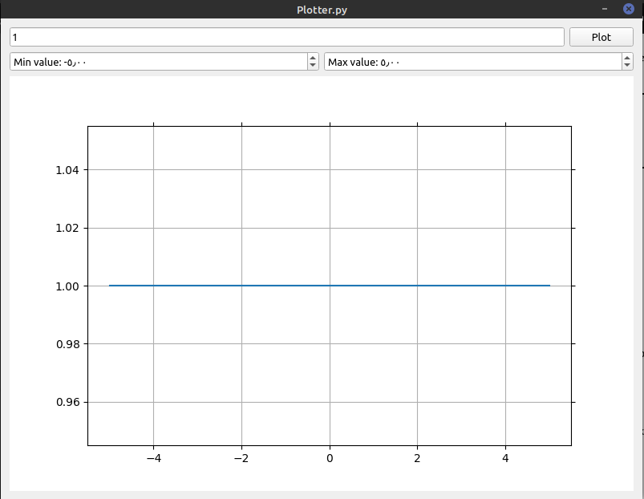
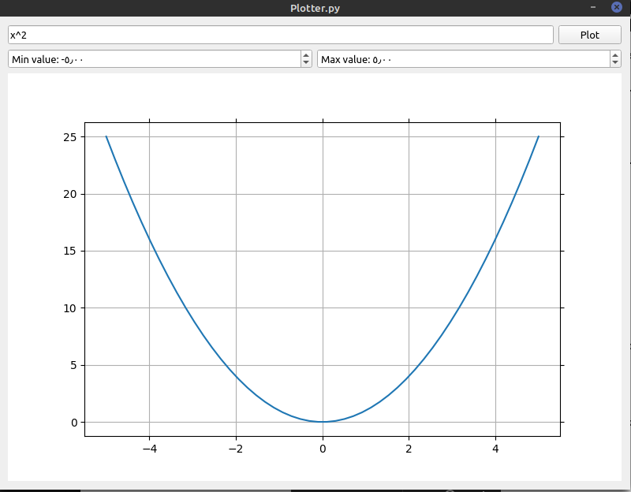
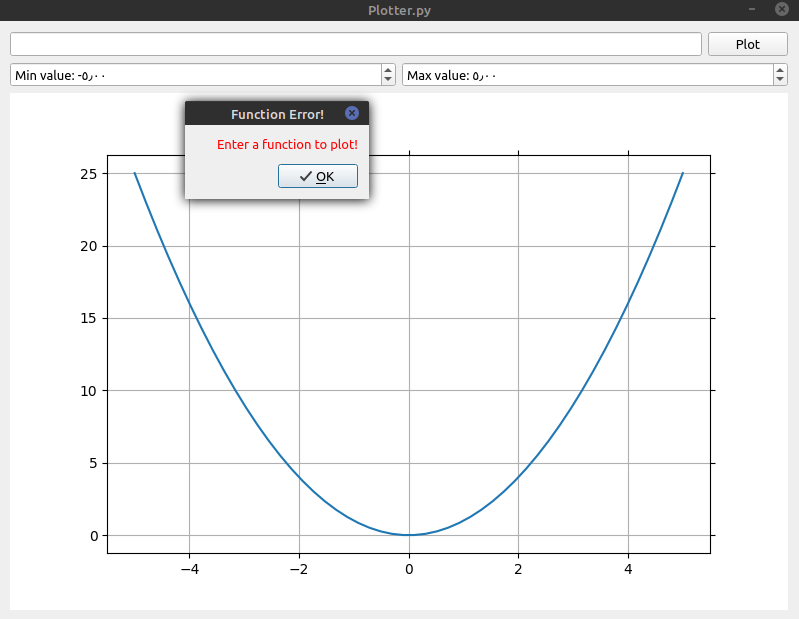
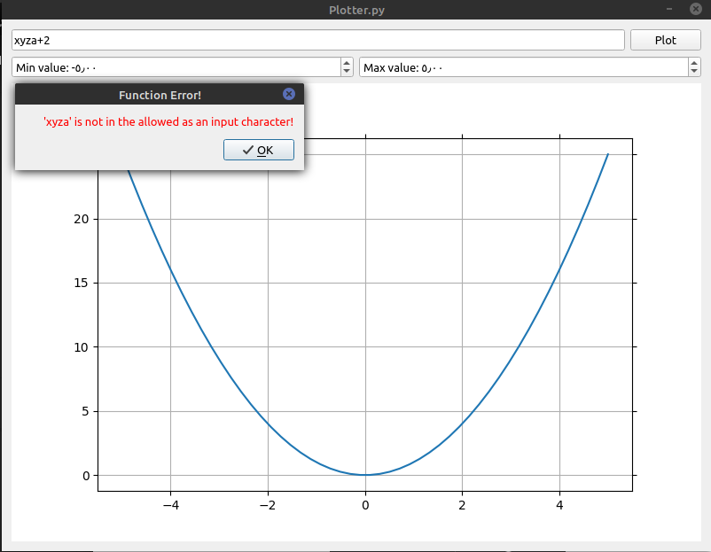
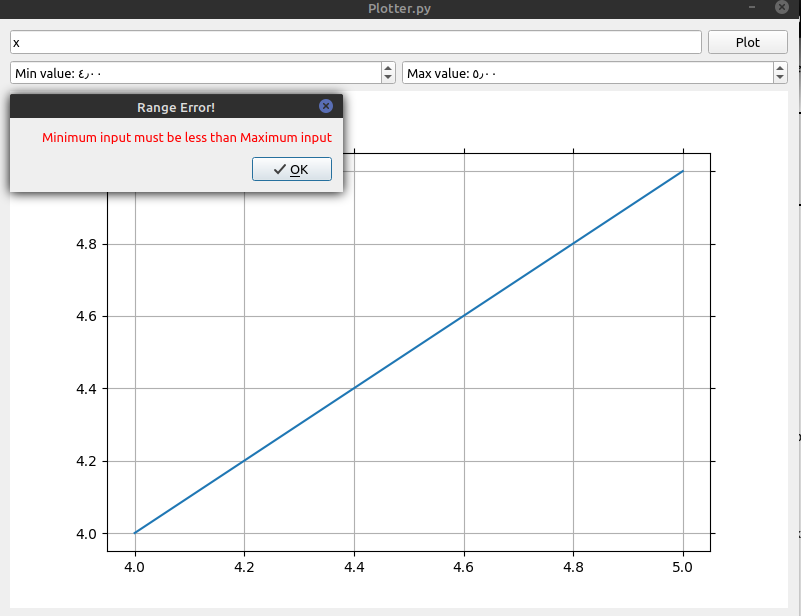
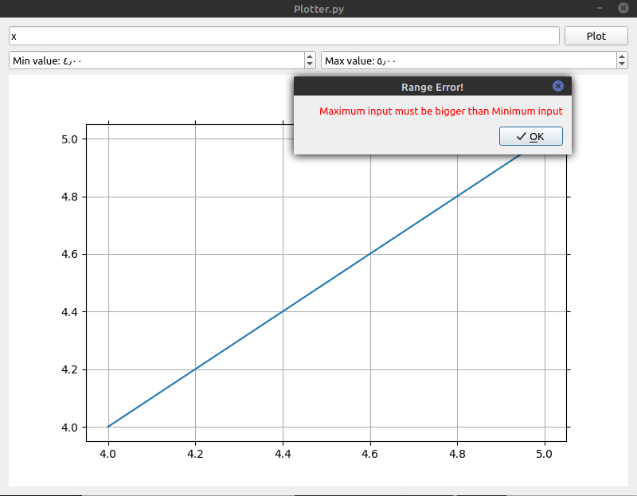

# Function Plotter

## Description

A GUI based program that plots an entered mathmatical function on a Matplotlib figure. It was built using Pyside2.

## Teck Stack

Python3 -> Pyside2, Numpy, Matplotlib

## Install the Dependencies

```bash
pip3 install -r requirements.txt
```

## Run Local

* Clone the repository

```bash
git clone https://github.com/abhijeet007rocks8/Dev-Scripts
```

* Change Directory

```bash
cd Dev-Scripts/Python/Function-Ploter/
```

* Run the script

```bash
python3 plotter.py
```

* Enter a mathematical x-function.
* Click plot to view the output.
* Change x values range as desired.

## Demonstration Video

https://user-images.githubusercontent.com/64689436/159015182-28e2523a-c0c2-4465-8ec7-6b6a94c46268.mp4

## Working Examples

* ### Valid X-Function

* ### Constant Function

* ### Quadratic Function


## Wrong Examples

* ### Empty Fucntion

* ### Invalid Function

* ### Min Range > Max Range

* ### Max Range < Min Range


<hr>
