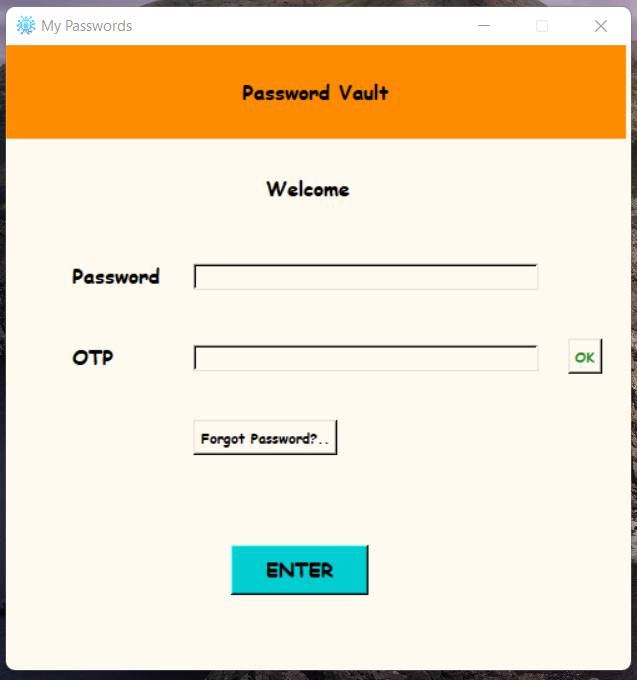
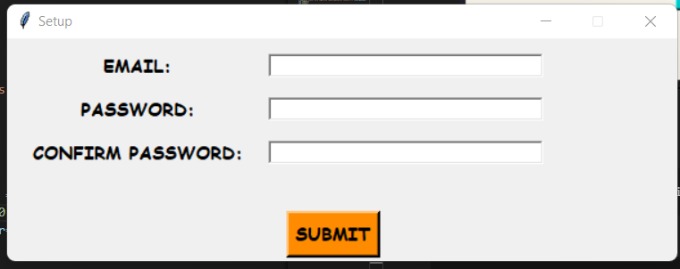
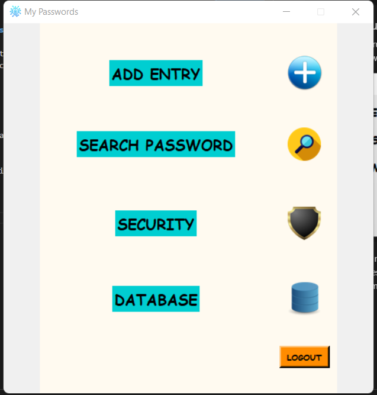
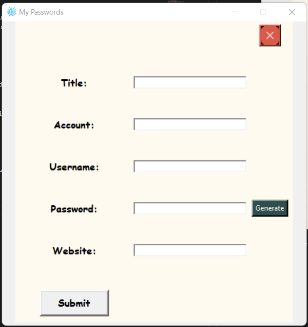
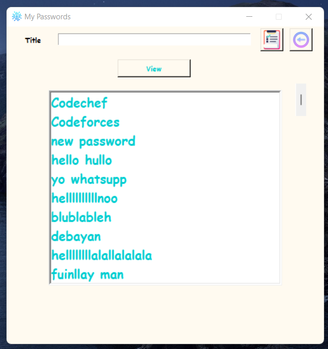
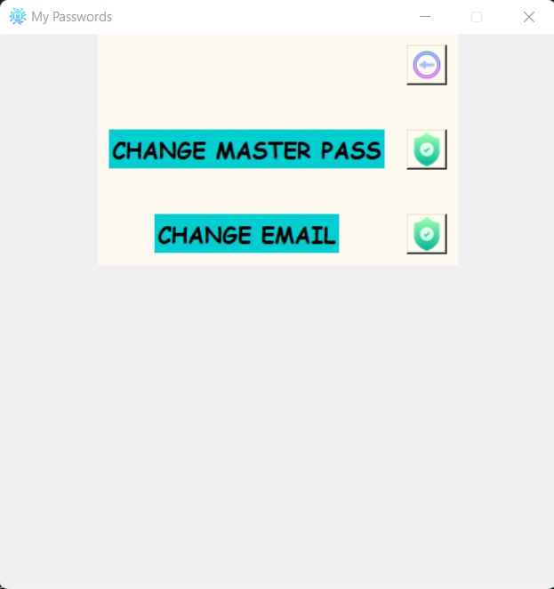
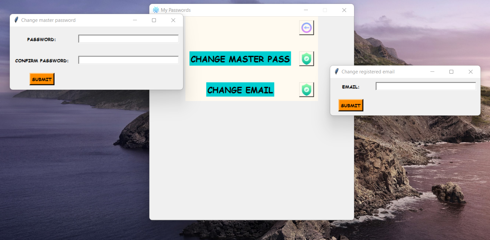
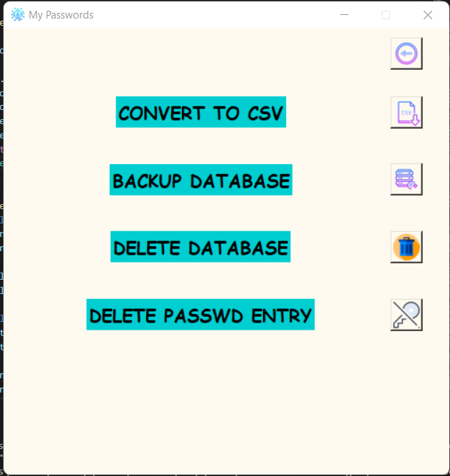

<br>

# Offline Password Manager
<br>

## Description:
<br>

### A simple passwrod manager to store your passwords in a database in you own system hence you will be in full control of your passwords without any third party being involved integrated with a simple UI and login, copy to clipboard functionalities
with scope for improvement as well.

## Note * Before starting create a temporary email, head over to the sending_email.py file and in the email and passworfd field put the email address and the password of that tempoeary email .(This email will be from where the otp mail will be sent if u forget the password )....U can ignore this functionality and just use your master password to login(but dont't forget it :)...
<br>
<p align="center">

</p>

## Getting started

- Clone the repository
```
git clone https://github.com/abhijeet007rocks8/Dev-Scripts.git
```
- Move to the folder
```
cd Dev-Scripts/Python/OfflinePasswordManager
```

## How to set up and save your passwords

<br>

* ## 1. First run the setup.py file and set up the email address(will be used to send OTP in case u forget your password) and choose a master password.

<p align="center">

</p>

* ## 2. Now run the main password.py file and login in with a password that you used during the setup process

* ## 3. The main page of the app will be vidible now

<p align="center">

</p>

* ## 4. In order to add entry to the database click on the plus button and fil up the informantion that you want to store the title and password are not to kept empty for the information to be stored, a check has been implemented to see if the title and password feilds are empty while submitting to database also title is unique for every password stored

<p align="center">

</p>

* ## 5.Greate u stored your first password now in order to use it whenever u need click on the search button in the main page

<p align="center">

</p>

* ## 6. In order to copy a password write the title of the password in the title box and press on the clipboard button next to it and u'll have it copied in your clipboard
 <br>

* ## 7. Inorder to change the master password or the registered email click on the security button and u will see the options to change them and on clicking the corresponding buttons u can set the new imformation

<p align="center">

</p>

<p align="center">

</p>

* ## 8. There is also the option to convert the db to a csv file , to delete database or to backup the database, as well as to share the databse in pdf

<p align="center">

</p>

## you can convert take copy of database in a csv file , u can back the database up, u can delete the database and entry a partiular password with the title by clicking on the corresponding buttons
<br>
<br>

## Tech Stack 
* ### Python 3
* ### Sqlite3
* ## Tkinter


<br>

* # 🙂Links

## [Connect with me 😀](https://www.linkedin.com/in/debayan-pradhan-b138641b4/)
## [My github ⭐](https://github.com/Phoenix-031)

<br>

## Note: A lot more features can be added :) happy storing passwords!!

## A video walkthrough

### running the setup.py file

https://user-images.githubusercontent.com/55997552/157315983-5ac466d0-ea17-4e9d-8930-74dc08e23256.mp4

### running the main app

https://user-images.githubusercontent.com/55997552/157316429-a048b599-8b0d-453d-9b5c-e3bc81930460.mp4


