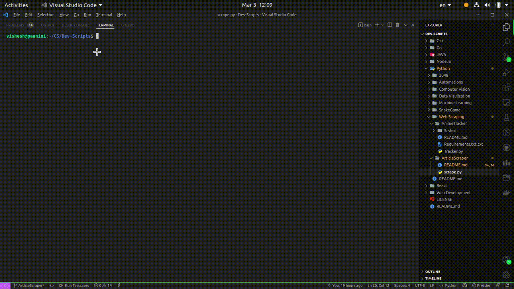

# Article Scraper

Scrapes articles for their Title and Body for the given url.

## Tech Stack
Python, BeautifulSoup

## Demonstration



## Basic Components
The script uses the bs4 package.

## Running on local

1. Fork the repo clicking on the fork button in the top right corner

2. Clone the repo to your local machine using the following command 
```
git clone https://github.com/<your-github-username>/Dev-Scripts.git
```

3. Packages to be installed: bs4==4.10.0, requests==2.22.0. Run the following:

```
pip install bs4==4.10.0 requests==2.22.0
```

4. Just run the scrape.py with url as the command line argument. There can be any number of urls.

```
python scrape.py https://www.link-to-the-article.comes/here https://www.maybe-another-article.com/
```

5. Look for the saved articles in the same directory named by their index numbers.