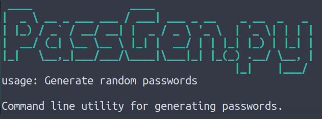
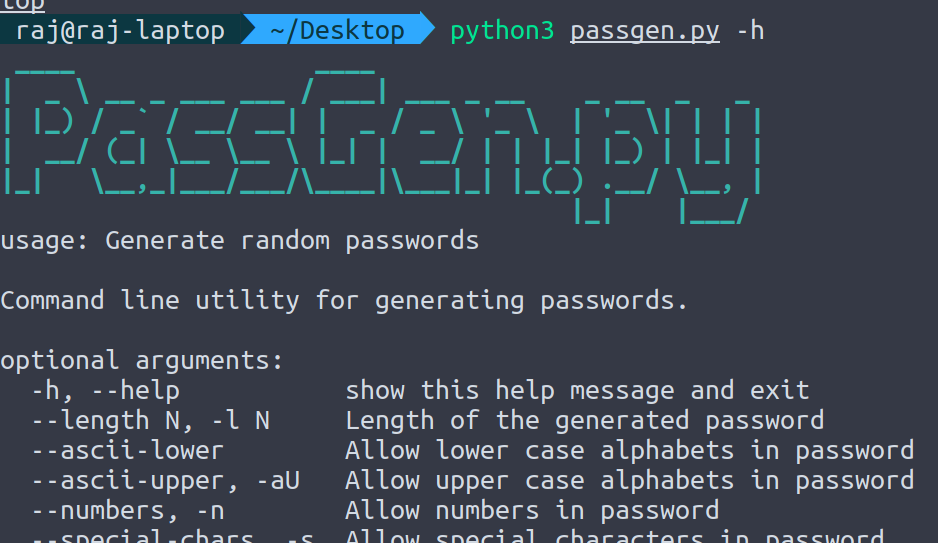
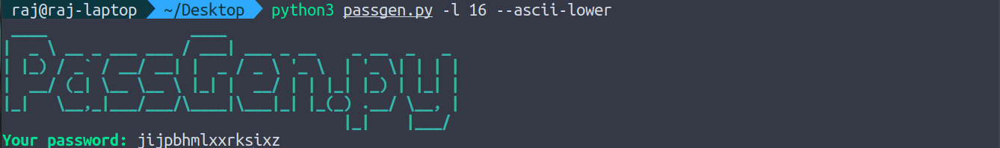
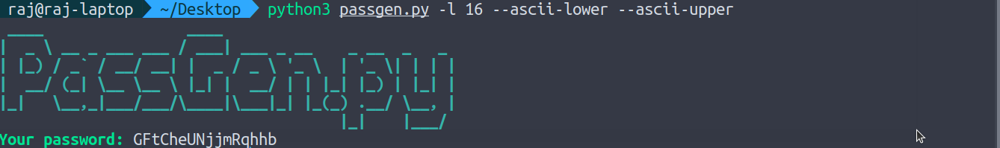
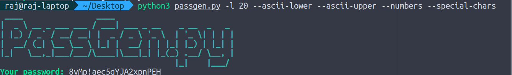

# PassGen

A simple python powered password generator

<p align="center">

</p>

## Getting Started

- Clone the repository
```
git clone https://github.com/abhijeet007rocks8/Dev-Scripts.git
```
- Move to the executable folder
```
cd Dev-Dev-Scripts/Python/password-generator
```

## Deployment

### Download and install python
#### Debian linux
```
sudo apt update
sudo apt install python3 
sudo apt install python3-pip
```
#### Fedora linux
```
sudo yum update
sudo yum install python3 
sudo yum install python3-pip
```
#### Windows

Download from https://www.python.org/downloads/

### Installing the dependencies

- Make sure you are in the `Dev-Scripts/Python/password-generator` folder
- Install the requirements
```
pip install -r requirements.txt
```

After this, you are good to go!


## Launching
The command is as simple as it gets. Simply type,
```
python3 passgen.py -h
```

## A Quick Demo
#### Displaying help message -
```
python3 passgen.py -h
```
<p align="center">

</p>

#### Generating passwords
```
python3 passgen.py -l 16 --ascii-lower
```
<p align="center">

</p>

```
python3 passgen.py -l 16 --ascii-lower --ascii-upper
```
<p align="center">

</p>

```
python3 passgen.py -l 16 --ascii-lower --numbers --special-chars
```
<p align="center">

</p>

```
python3 passgen.py -l 20
```
<p align="center">

</p>

## Tech Stack

- Python3

## Author 

Rajdip Bhattacharya