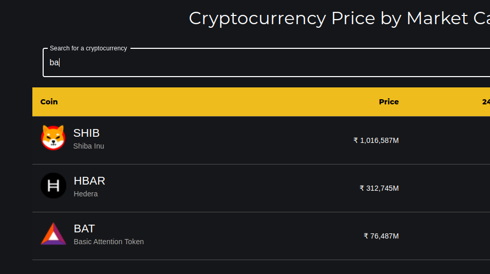
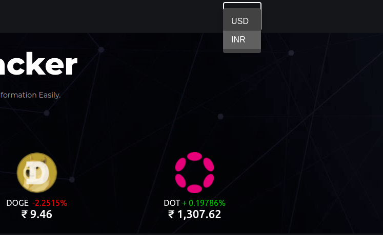
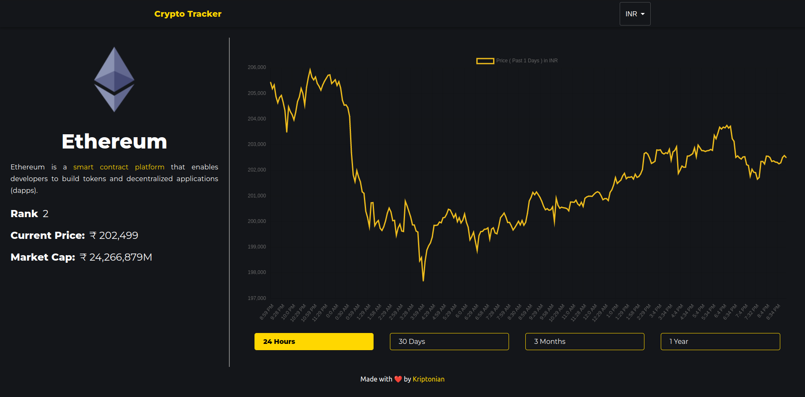

<div align='center'>

   # Crypto Tracker

</div>

<div align='center'>


</div>

</br>

<div align='center'>

</div>

</br>

 ### Crypto Tracker is a web application that tracks the current price of crypto currencies and allows users to track their favorite cryptocurrencies in INR and USD 

</br>

# Features ✨

- ## Track the current price of crypto currencies
  
- ## Search for crypto currencies by name
  
- ## View the current price of crypto currencies in INR and USD
  
- ## Visualize the current price of crypto currencies in a graph
  

</br>

# Setup 🛠️

- Clone the repository 
  ```bash
  git clone https://github.com/abhijeet007rocks8/Dev-Scripts.git
  ```
- Navigate to `Dev-Scripts/React/crypto_tracker`
  ```bash
    cd Dev-Scripts/React/crypto_tracker
  ```
- Install dependencies
  ```bash
    npm i
    ```
- Run the application
    ```bash
    npm start
    ```
- Open the application in the browser.\
Open browser and navigate to [http://localhost:3000](http://localhost:3000)

</br>

# Tech Stack 🔧

- React 
- React Router
- Material UI
- React Chart.js
- Material-UI