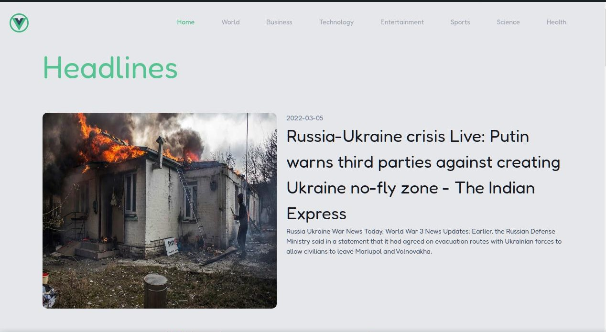
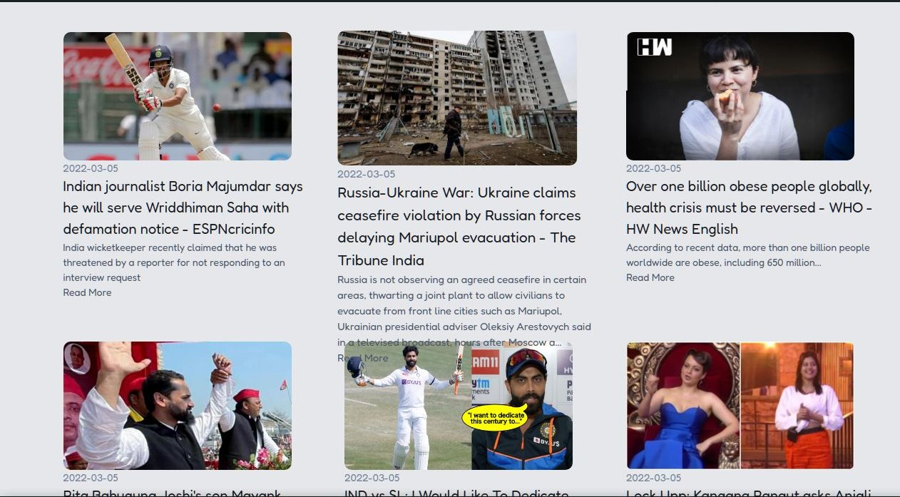

# Vue News
  News Website made for smooth operation and visually attractive for the customer.
  
  ## Tech Stack
  ```
   VueJS
   Chakra UI
   Tailwind CSS
  ```
  ## Demonstration
  
  
  
  
  
  ## Basic Components in Project
  ```
  HelloWorld.vue
  ```
  ## Project setup
  ```
  npm install
  ```

  ### Compiles and hot-reloads for development
  ```
  npm run serve
  ```

  ### Compiles and minifies for production
  ```
  npm run build
  ```

  ### Lints and fixes files
  ```
  npm run lint
  ```

  ### Customize configuration
  See [Configuration Reference](https://cli.vuejs.org/config/).
