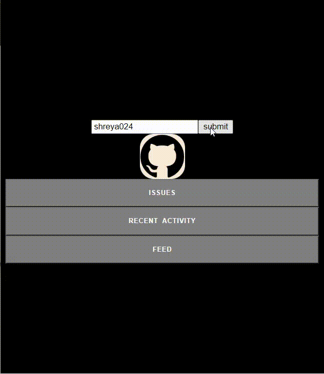

# **The Github Activity Generator**

This Github Activity Generator will showcase the status of feed, issues and recent activity of a Github User.

## Technologies used :

- HTML
- CSS
- JavaScript
- Github REST API

## Description :

It provides the status of feed, issues and recent activity when provided with the Github username as input. This will make the life of any github user easier as they can readily check their recent github developments.

I used Github REST API to fetch data when the submit button is clicked it will fetch the user data and and is visible on our screen using html,css and javascript.

---

## Run Local

- Clone this repository

```bash
git clone https://github.com/abhijeet007rocks8/Dev-Scripts
```

- Change Directory

```bash
cd Dev-Scripts/"Web Development/Github_Activity_Generator/"
```

- Open `index.html` in browser.

And view your Github activities.......

## Simulation Video


