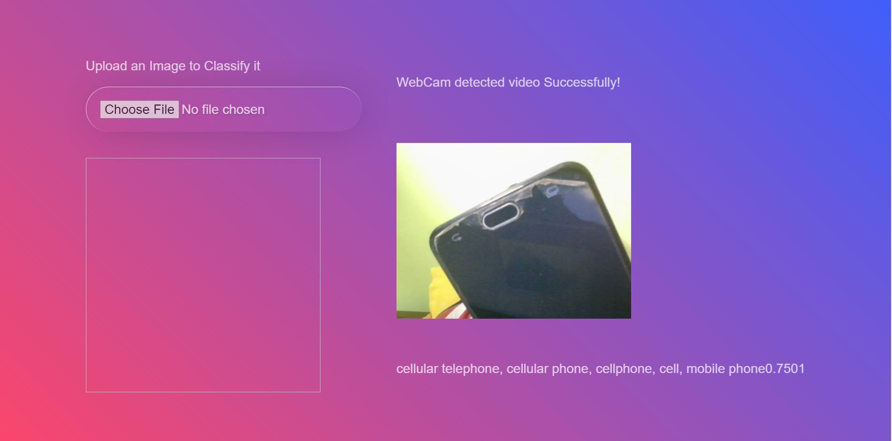

<h1>Image Classifier</h1>

<p>Image Classifier written in HTML, CSS, and JavaScript .</p>

### Use of the Project:

<p>Using ml5.js to perform image classification </p>

<h3>Used Technologies</h3>
<ul>
  <li>HTML5</li>
  <li>CSS3</li>
  <li>JavaScript</li>
</ul>

### Steps to Use:

**1.** Start by making a fork the [**Dev-Scripts**](https://github.com/abhijeet007rocks8/Dev-Scripts) repository. Click on the <a href="https://github.com/abhijeet007rocks8/Dev-Scripts/fork"></a> symbol at the top right corner.

**2.** Clone your new fork of the repository:

```bash
git clone https://github.com/<your-github-username>/Dev-Scripts
```

**3.** Navigate to the project directory:

```bash
cd Dev-Scripts/Web Development/Image Classifier
```

**4.** Navigate to the classifier.html Page

- Now Write Click on Open With Live Server

**5.** Click on choose file to upload an image or start webcam to classify the image

</br>

<h3> ScreenShots </h3> 


<br>

<h3> Sample Video </h3>
