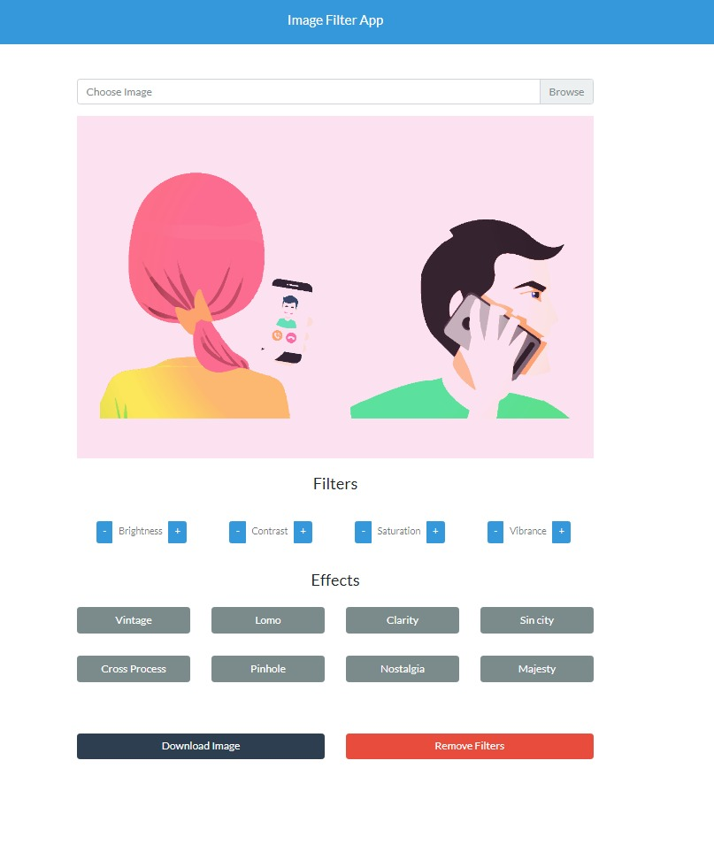

<p align="center">
    
  </a>
</p>
<h1 align="center">Image Filter </h1>

<div align="center">
 An Awesome Image Filter App written in HTML, CSS, JavaScript and CamanJS .
</div>


## Description:
A Image Filter App helps to apply filters to your image as well modify different image characteristics like brightness etc.

---

## Tech Stack Used:
HTML5,CSS3,JavaScript

---

## It Look's Like:



---


## Video Demo:


---


---

## **Quick Start**
- Clone this repository

``` 
git clone https://github.com/abhijeet007rocks8/Dev-Scripts.git
```
- Change Directory

```
cd Web Development
```
```
cd Change Image Filter

```

```
cd index.html
```
> open ```index.html``` file in your default Browser.
---

## **Installation and Dependencies**
- Install any Code Editors like : VS Code, Atom, etc.
- Then follow the ```Quick Start``` steps given above and open the 
Change Letter Casing in your Code Editor.
- Then open ```index.html``` file then edit the details and save it .

