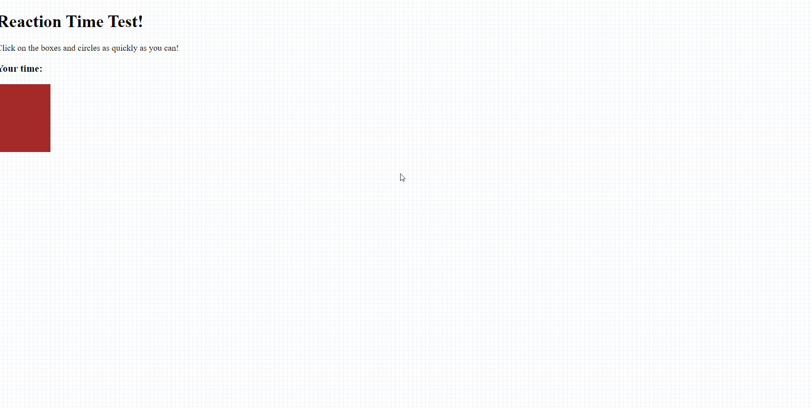

# Reaction Time:

Game That Is Used to test the Reaction Time Click on the Box As quickly As you can and get the time for that.

# Tech Stacks:
- HTML 
- CSS 
- JS

# Demo:



## **Quick Start**
- Clone this repository

``` 
git clone https://github.com/abhijeet007rocks8/Dev-Scripts.git
```
- Change Directory

```
cd Web Development
```
```
cd MouseClick

```
```
cd index.html
```
> open ```index.html``` file in your default Browser.
---

## **Installation and Dependencies**
- Install any Code Editors like : VS Code, Atom, etc.
- Then follow the ```Quick Start``` steps given above and open the 
Change Letter Casing in your Code Editor.
- Then open ```index.html``` file then edit the details and save it .

