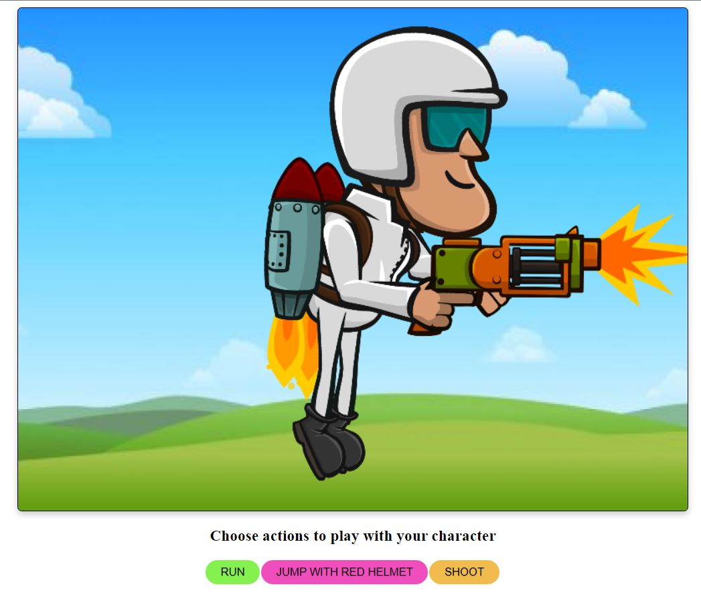

<h1>Spritesheet Animation</h1>

<p>Spritesheet Animation written in HTML, CSS, and JavaScript .</p>

### Use of the Project:

<p>Using spritesheets to perform animation </p>

<h3>Used Technologies</h3>
<ul>
  <li>HTML5</li>
  <li>CSS3</li>
  <li>JavaScript</li>
</ul>

### Steps to Use:

**1.** Start by making a fork the [**Dev-Scripts**](https://github.com/abhijeet007rocks8/Dev-Scripts) repository. Click on the <a href="https://github.com/abhijeet007rocks8/Dev-Scripts/fork"></a> symbol at the top right corner.

**2.** Clone your new fork of the repository:

```bash
git clone https://github.com/<your-github-username>/Dev-Scripts
```

**3.** Navigate to the project directory:

```bash
cd Dev-Scripts/Web Development/Spritesheet Animation
```

**4.** Navigate to the index.html Page

- Now Write Click on Open With Live Server

**5.** Click on any of the three buttons to view the animation

- Run to make the character run
- Jump with red helmet to make the character jump with a rocket and red helmet
- Shoot to make the character shoot!

- View the animation and Enjoy .

</br>

<h3> ScreenShots </h3> 


<br>

<h3> Sample Video </h3>


https://user-images.githubusercontent.com/72400676/162341839-1567cdbd-a39f-4aca-8f80-9080626fc523.mp4


<br>
