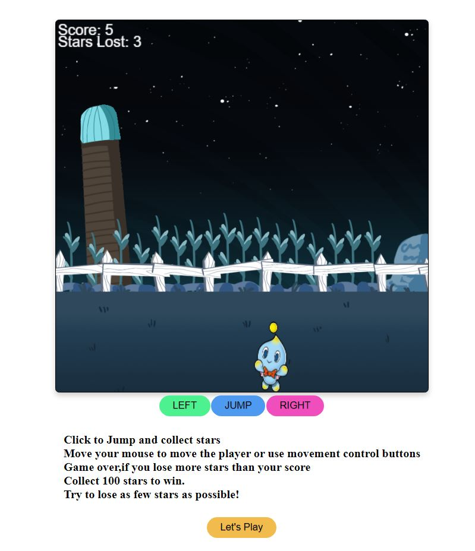

<h1>Star Catching Game</h1>

<p>Star Catching Game written in HTML, CSS, and JavaScript .</p>

### Use of the Project:

<p>The Star Catching Game is a single-player game </p>

<h3>Used Technologies</h3>
<ul>
  <li>HTML5</li>
  <li>CSS3</li>
  <li>JavaScript</li>
</ul>

### Steps to Use:

**1.** Start by making a fork the [**Dev-Scripts**](https://github.com/abhijeet007rocks8/Dev-Scripts) repository. Click on the <a href="https://github.com/abhijeet007rocks8/Dev-Scripts/fork"></a> symbol at the top right corner.

**2.** Clone your new fork of the repository:

```bash
git clone https://github.com/<your-github-username>/Dev-Scripts
```

**3.** Navigate to the project directory:

```bash
cd Dev-Scripts/Web Development/Star Catching Game

```

**4.** Navigate to the star_catching_game.html Page

- Now Write Click on Open With Live Server

**5.** Click on Let's Play

- Click to Jump and collect stars
- Move your mouse to move the player or use movement control buttons
- Game over,if you lose more stars than your score
- Collect 100 stars to win.
- Try to lose as few stars as possible!

- Play and Enjoy .

</br>

<h3> ScreenShots </h3> 


<br>

<h3> Sample Video </h3>


https://user-images.githubusercontent.com/72400676/162098602-fe77987a-82b6-4a62-a16a-4c414c3420a7.mp4


<br>


