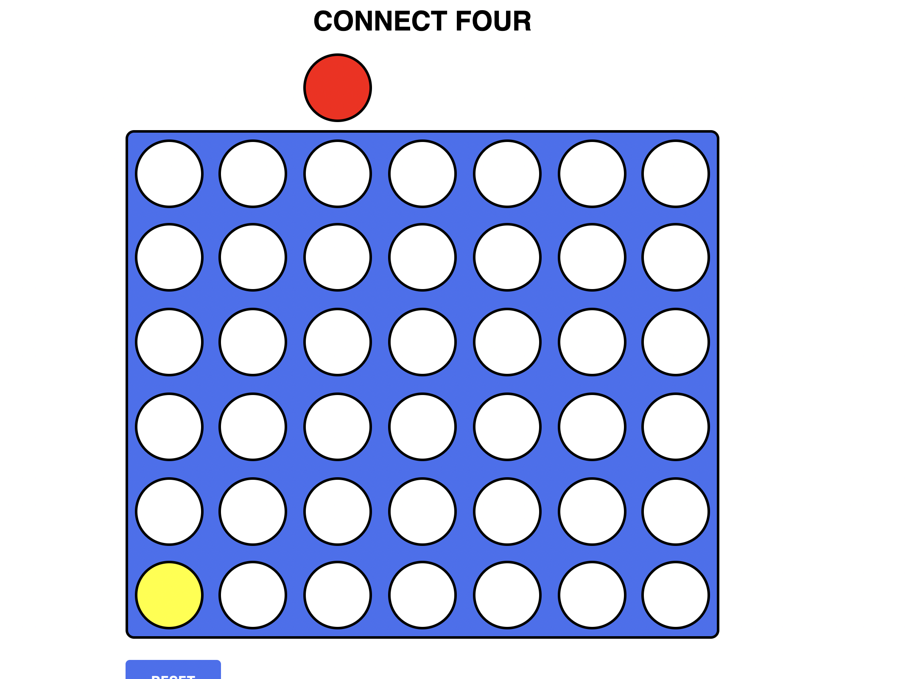
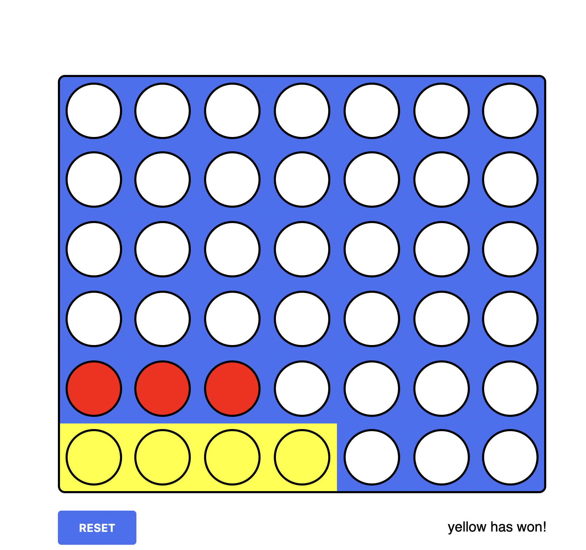
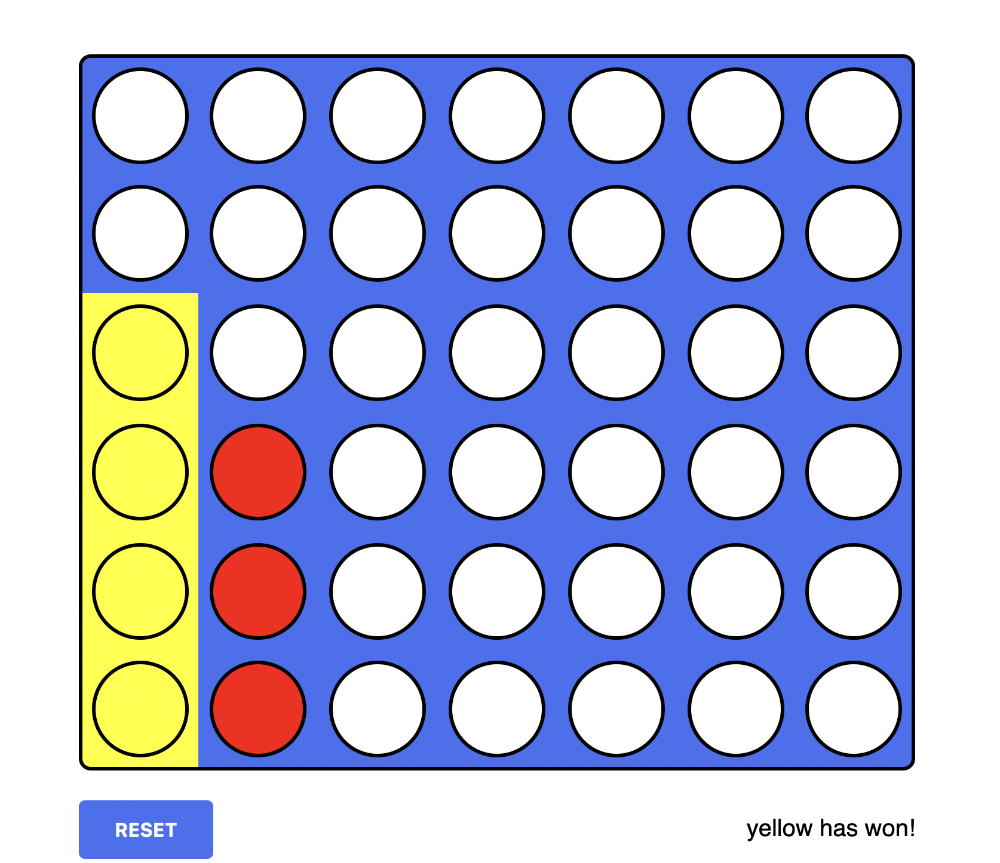
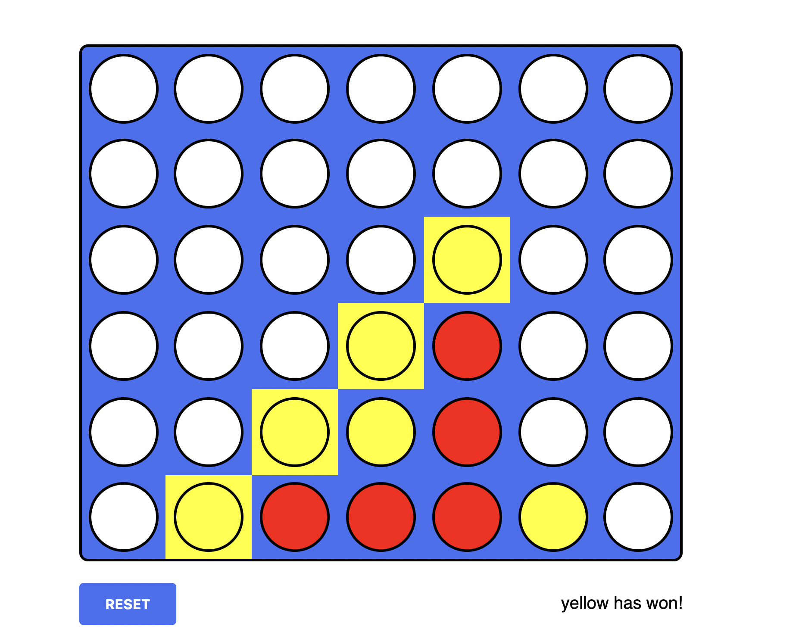
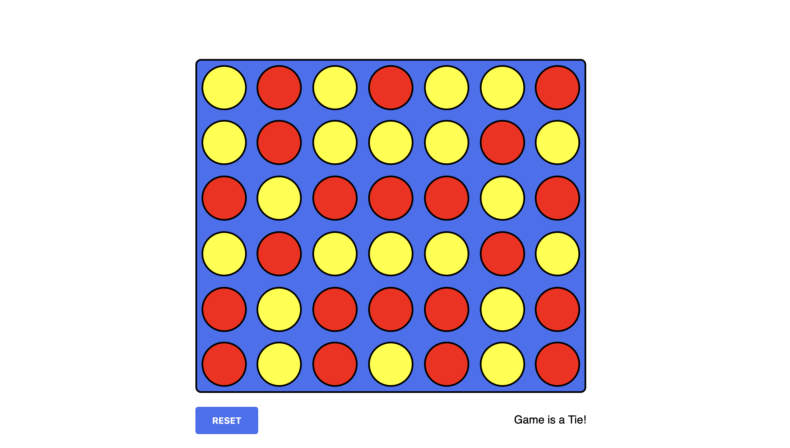
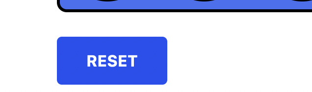

# **Connect Four**

-Players are distinguished by game piece color (yellow and red).
-Players must alternate turns, and only one disc can be dropped in each turn. 
-On your turn, drop one of your colored discs from the top into any of the seven slots.
-The game ends when there is a 4 in a row or column or diagonal or a stalemate.

## **TechStack**
-Html 
-Css
-Javascript
## **VideoDemonstration**

https://user-images.githubusercontent.com/67006588/159767642-79f8edde-e983-4bd7-a31e-caa65f8c32f6.mp4


## **Demonstration**
-Player one gets the yellow color and player 2 gets the red color.


-You can win the game by having 4 pieces consecutively horizontally.


-You can win the game by having 4 pieces consecutively Vertically.


- Or you can win the game by having 4 pieces consecutively Diagonally.


-If the game results in a tie then it will be displayed at the bottom 


-You can also reset the game any give given point by clicking on the Reset button 


## **Quick Start**
- Clone this repository

``` 
git clone https://github.com/abhijeet007rocks8/Dev-Scripts.git
```
- Change Directory

```
cd Web Development
```
```
cd connect-four
```
```
cd index.html
```
Inside connect-four folder open ```index.html``` file in your default Browser.

## **Installation and Dependencies**

- Install any Code Editors like : VS Code, Atom, etc.
- Then follow the ```Quick Start``` steps given above and open the Portfolio project in your Code Editor.
- Then open ```index.html``` file then edit the details and save it . Then your Portfolio is all set for use.
